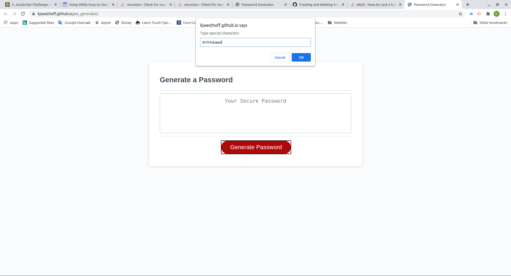

# Password Generator
Generates a password of length 8 to 128 characers from user selected characters. 

## Find it here:
https://kjwesthoff.github.io/pw_generator/

## Features:

### Password Length
Length must be between 8 and 128 characters, input must be integers, if letters or other chacters are input, users will be re-prmpted to input a number, decimal numbers are rounded to nearest integer.

### Password characters
User is asked to select from upper and lower case, alphanumeric and special characters.

### Special charcaters
Ususal special charcters available on most keyboards are suggested, if the user prefers to choose special charcters themselves, the suggested can be cancelled and personalized characters entered. Furthermore, if all other options are cancelled prefereed letters and numeric charaters can also be entered as custom special charaters.

### Minimum number of characters
The minimum number of unique characters required is 4, if less is entered the user will be re-prompted to select characters.

### Weight of characters
All charcaters are weighted equally irrespective of the number of times a special character has been entered.

## The app looks like this:

